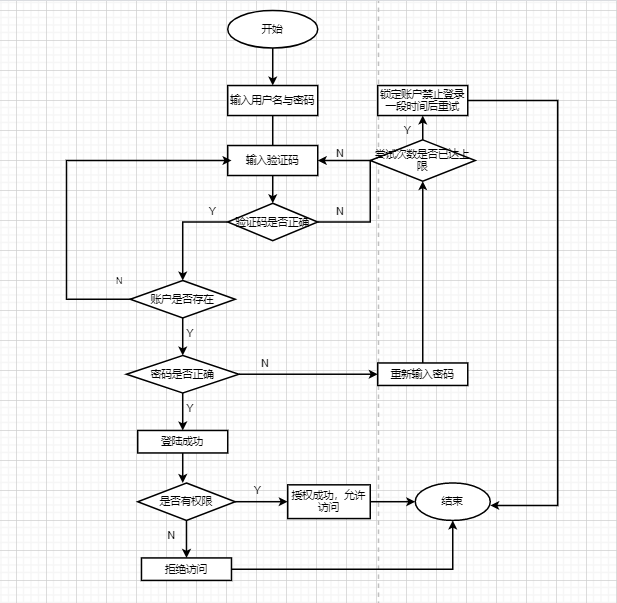
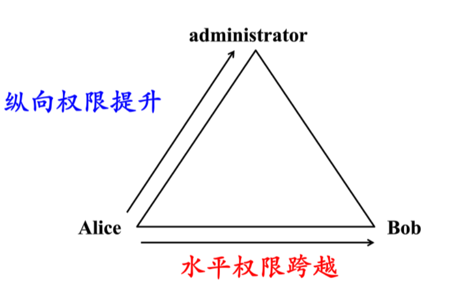

# 内部的访问控制设计实例研究

### 实验环境

- 操作系统版本：2.0.0

- 版本号：2.0.0.168(C00E160R5P8patch02) GPU Turbo

- 硬件设备型号：JEF-AN00

### 实验结果

以 HarmonyOS 系统为研究对象

- 当系统出现锁屏状态下接收到新消息时，不出现情况下

  - 系统是否允许查看短信内容？**不允许**
  - 系统是否允许回复短信？**不允许**

- 当系统**抢锁屏状态下**，使用系统内置例如（iOS的Siri）或自己的语音助手可以完成以下哪些操作？

  - 访问通讯录：**不能**
  - 拨打电话：**可以**。

  - 访问相册：**不能**
  - 查看短信收件箱：**不能**

  需要语音助手录入声音的人唤醒，其他人无法唤醒。（华为HarmonyOS的语音助手提醒为“小艺小艺”）。

- 如果你的比较手机支持识别识别手机，并分析并识别出相较的密码、复杂的密码、简单的制作、人脸识别的安全声纹、等活动方式的不同性、便利性。

- 安全性

  - 简单的密码：突发事件的消息发生的原因是简单的密码，因为密码被破解的一般简单，可以安全快速地找到各方面的时间。
  - 复杂密码：安全性区别简单密码。
  - 图形密码：简单的图形密码也容易被破解。而且图形密码和简单密码容易被偷窥而破解。
  - 人脸识别发现：人脸识别的准确率对许多外部因素的影响，而且人脸引起的影响，以及人脸引起的改变，不排除使用了一些重大的数据以及统计数据。
  - 声响发出：人脸识别相似，对小环境因素的影响很敏感，而且如果有声音发生变化如实例等，就可以影响声响的准确率（准确率）。
  - 指纹：如人脸识别可能用照片泄露，声纹识别可能被记录泄露，伪装成破译=获取用户的指纹，而用户可以在各种地方指纹，但复制指纹需要一定的的技术手段，因此我认为安全性是中等的

- 方便性

  - 指纹是非常方便的方式（特别是在后新冠时代下），因为传统密码需要输入，图形密码需要在屏幕上划动，人脸识别需要对着摄像头调整好光和角度且没有面具的一种方式遮蔽如口罩，声纹识别对小人环境的要求比较说明。
  - 如果在培养器上，识别出某些特定的缺陷，传感器上有污物的时候，就会发生反应，这时候，启动的电池激发方案和人脸识别可以成为备用

### 思考题

- 以上设计实现方式属于我们课堂讲过的强制访问控制模型？Lattice/BLP？Biba？ **属于BLP模型**：对于刚接收的短信，所有普通用户（低安全等级）都可以查看，属于下读行为；可以回复短信，属于上写行为。

- 系统或第三方应用程序是否提供了上述功能的访问控制规则修改？如果修改默认配置，是提高了安全性还是降低了安全性？ **是**，但是第三方应用程序对安全性的影响依赖于用户的设置，如果降低就，安全性就会降低。

### 课后题

#### 1. 生物特征身份认证方式有哪些？优分析？应用场景举例

**指纹识别**

优点：

- 个体独特性
- 采集相对容易
- 进行身份认证时方便快捷

缺点

- 指纹留下的指纹极易获取，这些指纹可能被盗取并用于复制指纹。
- 容易被天气好，马上就可以改变了（指纹密码无法说改就）
- 采集指纹利用，成本高。

应用：

- 圣诞检验
- 个人资料数据库
- 银行

**虹膜识别**

优点：

- 错误率在各种生物特征身份认证中相对较低
- 有可能不变
- 个体差异性显着
- 具有非接触性，用户无需和设备直接接触就获取了图像，干净卫生，避免发生可能的疾病传染；

缺点：

- 用于虹膜识别的硬件设备小型化不易；
- 相较于其他生物识别硬件，虹膜识别硬件造价，大范围推广困难；
- 使用引导性行为，识别准度略低，反应速度较慢。

应用：

- 矿山人员安全管理；
- 建筑实名制认证；
- 教育考试；
- 司法安检

**人脸识别**

优点：

- 非接触性，比较其他生物识别技术的话，人脸识别是非接触的，用户不需要和设备直接接触。
- 自然性，即可以通过观察比较人脸来判断和确认身份。
- 使用方便，验证过程响应。
- 用户接受度高。
- 不难冒。
- 精度高、稳定性强、成本高。
- 收集率高，大量平台都提供了识别认证功能。

缺点：

- 人类生物存在相似性，不同个体之间的差异，所有的人脸的结构都很相似，甚至人的生命器官的结构看起来很像。
- 人脸容易变质，人脸的形态很稳定，人可以通过存在的变化产生很多表情。
- 不同角度的观察，脸的视觉形象也可以放大
- 人脸识别还受光照条件（例如面部识别和认知，室内和室外等）、人脸的很多遮盖物（例如口罩、墨镜、头发、胡须等）、年龄等多方面因素的影响。

应用：

- 门禁系统
- 天眼系统
- 网络应用
- 学生考勤系统
- 照片检索

**声纹识别**

优点：

- 声纹提取方便，可在不知不觉中完成，因此用户的接受程度也高；
- 获取语音的识别录音，使用，一个电话，在使用简单的通讯设备时更无需额外的录音设备；
- 适合远程确认，只需要一个电话或电话、手机就可以实现远程登录；
- 声纹辨认和确认的算法复杂度低；
- 配合一些其他措施，如通过内容识别等，可以提高准确识别率。

缺点：

- 同一个人的声音具有易变质，易受身体状况、年龄、情绪等的影响；
- 不同的声音和信息对识别性能有影响；
- 环境噪音对识别有干扰；
- 混合说话人的场景下人的声纹特征不易突出。

应用

- 一些对于身份安全要求并不太高的物品，比如智能智能，智能家具等。

**静脉识别** 

优点：

- 高度防伪
- 温和易用
- 快速识别
- 高度准确度

缺点：

- 手背静脉可能会随着年龄和生理的变化而发生变化，还有没有得出结论；
- 仍然存在无法成功注册的可能；
- 由于采集方式受自身特点的限制，产品小型化；
- 采集设备有特殊要求，设计相对复杂，制造成本高。

应用：

- 门禁
- 社保行业
- 健身行业
- 调节场所

#### 2.“找回密码功能”和“忘记密码”在访问授权中的意义？请教设计几个安全的“找回密码功能”，详细找回密码的用户具体操作过程。 

- 意义：

  “找回密码功能”和“忘记密码”是在真正被授权忘记用户密码时对获取权限的方式，从而使客体能够正常访问。

- “找回指令功能”具体操作过程：

  - 找回密码就是让用户登录密码。
  - 产生密码的时候，要给出一个链接，让用户到网页上修改自己的密码。
  - 之前发生密码，如果用户提供了错误的邮件地址，请不要提示他。
  - 原来密码的时候，识别用户最好依靠邮件地址，而不是用户名。
  - 如果条件允许，先验证密码，最好请用户回答一些个人问题，比如短信验证码。

#### 3.简单用户使用用户名/密码+图片验证方式录入系统的流程图。考虑认证成功和失败场景，考虑授权成功和失败场景。

#### 4.Windows XP / 7 中的访问控制策略有哪些？访问控制机制有哪些？

- 访问控制策略： 自主访问控制：（DAC，Discretionary Access Control）的特点是根据主体的访问权限的权限进行身份及决定。集归属其他主体强制访问控制：（MAC，Mandatory Access Control）并能在计算机上使用算法表达的执行策略，强制访问控制的实现通常都内置在软件源代码里的算法实现中，在系统发布后无法被修改基于角色的访问控制：（RAC，Role-Based Access Control）是基于角色的访问控制是一个复合规则。一个身份被分配给一个被授权的组。角色与组的区别是：组只是一组用户的集合，而角色是一组用户的集合加在一起的。操作权限的集合
- 访问控制：
  - 访问令牌（访问令牌）
  - 安全任务（安全描述符）
    - 安全标识（安全标识符，SID）
    - 访问控制列表（访问控制列表，ACL）
      - 自主访问控制列表（自主访问控制列表，DACL）
      - 系统访问控制列表（系统访问控制列表，SACL）

#### 5.用下知识模型来理解并描述并描述2种威胁模型：提权、模仿冒充。

- 提权：提权就是通过各种和漏洞，提高自己在服务器中的权限，便于控制

  - 水平权限提升：指不同权限下不同的用户可以互相访问
  - 纵向权限提升：指使用权限低的用户可以访问权限的用户
  - 例如：一个论坛网站有两个普通用户A和B，还有一个管理员C，A获得了删除B帖子的权限就是水平越权；A获得了删除C帖子的权限就是纵向越权

- 模仿：A以B的身份进行认证，拥有B的权利，发生了变化，发生的权利发生了变化

- ##### 权限三角模型：用户→角色（对象）→权限（+操作）
  
  

  - 提权是`用户→角色→权限`，角色不变，而获得的扩大权限
  - 仿冒是`用户→角色`，获得了角色的改变，所以能够行使的权限导致角色的改变而改变了

#### 6. 尝试通过操作系统的访问控制机制来达到预防真实病毒的运行目的。

通过修改组策略防止蠕虫病毒，例如熊猫烧香

- 利用**自动播放**功能
- 添加日记自启动
- 定时关闭特定程序，如杀毒软件、防火墙
- 删除文件等

1. 成为本机管理员组成员，一定要克服简单的口令传奇空口令。
2. 利用组策略，关闭所有驱动器的自动播放功能。
3. 修改选项，以查看文件的真实属性，避免不知骗子程序中毒。
4. 时刻保持操作系统获得最新的安全更新，不要随意访问未知的网站。
5. 启用Windows防火墙本地计算机

#### 7.什么是OAuth？

OAuth 的全是什么是开放授权，是一个标准的开放授权，它制定了一些标准，可以申请应用使用用户名登录获取用户资源。目前很多应用都提供了帐号登录及绑定，而这背后使用的技术就是Oauth2.0。常见的授权方式是使用授权码。

允许用户提供一个令牌和密码来访问他们的数据，而不是用户名和密码来访问他们的数据在特定的服务提供者。每一个授权特定的网站在特定的用户访问特定的资源。这样，OAuth 允许第一个。三方网站访问他们在其他服务提供者上的信息，而不需要分享他们的访问权限或他们的数据的所有内容。

#### 8.什么是OpenID？

OpenID是一个以用户为中心的数字身份识别框架，它具有开放、分散、自由等特性。OpenID可以通过URI来认证一个网站的唯一身份，同理，我们也可以通过这种方式来由于URI是整个网络世界的核心，它是基于URI的用户身份认证提供了广泛的、用户身份认证的基础。OpenID系统的第一部分是身份验证，即通过URI来认证用户身份。现在的网站都是靠用户名和密码来登录认证的，说明大家在网站上都需要注册用户名和密码，可以使用同样的密码

#### 9. 实验洞学理论分析 OAuth 和 OpenID 的区别与联系。

- OpenID 只属于身份认证，没有权限，它实现了证明“我就是我”
- OAuth 授权应用访问受保护信息的权限

从而容易的认证没有必要的外部O服务时认证，才可以进入网站的使用O认证

#### 10.如何使用OAuth和OpenID相关技术实现单点登录（Single Sign On）？

单点登录 (SSO)是一种对于许多彼此关连，但又是各自独立的软件系统，提供访问控制的属性。逐一登录。

##### 微软帐户

微软账户是一个单点登录账户，使微软用户登录微软网站（如Outlook），运行在微软的操作系统设备（如Windows10电脑/平板、WindowsPhone、Xbox），微软应用软件（如Visual Stdio）

1. 当用户第一次登录时，将用户名密码发送给用户服务
2. 验证用户将用户标识OpenId返回到客户端
3. 客户端进行存储
4. 访问流量，将 OpenId 发送到天气
5. 是否将OpenId转发到验证服务
6. 验证服务将用户认证信息返回给时间
7. 授权构建用户验证信息后将授权后的内容返回给客户端

### 参考资料

- [OAuth，维基百科](https://en.wikipedia.org/wiki/OAuth)
- [OpenID，维基百科](https://en.wikipedia.org/wiki/OpenID)
- [单点登录（SSO）看这一篇就够了](https://developer.aliyun.com/article/636281)
- [浅谈SAML、OAuth、OpenID和SSO、JWT和Session](https://juejin.im/post/5b3eac6df265da0f8815e906)
- [SSO 和 LDAP 身份验证](https://archive.is/20140523114521/http://www.authenticationworld.com/Single-Sign-On-Authentication/SSOandLDAP.html)
- [访问控制技术与Windows访问控制](https://wenku.baidu.com/view/ab8b4e2b453610661ed9f4aa.html)

