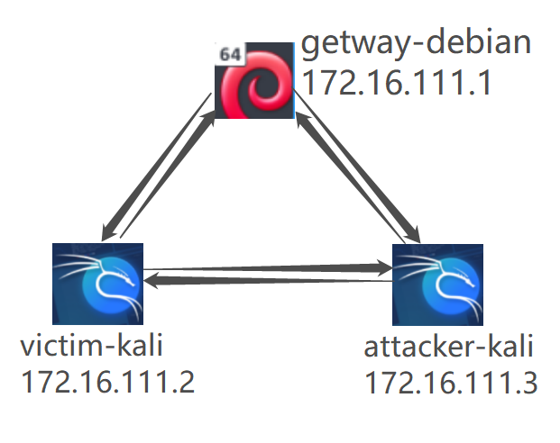

# 基于 Scapy 编写端口扫描器

## 实验目的

- 掌握网络扫描之端口状态探测的基本原理

## 实验环境

- python 
- scapy
- 攻击者主机（Attacker）：Kali-Linux-2021.2
- 网关（Gateway）：Debian 10
- 靶机（Victim）：Kali-Linux-2021.2

## 实验要求

- [x] 禁止探测互联网上的知识产权，坚决坚持网络安全相关法律规则
- [x] 完成以下扫描技术的编程实现
  - TCP连接扫描/TCP隐身扫描
  - TCP Xmas 扫描/TCP fin 扫描/TCP null 扫描
  - UDP扫描
- [x] 关闭扫描技术的实现测试需要全部测试端口状态为：`程序开放`、``和`过滤`时的执行结果
- [x] 提供一次扫描测试的抓包结果并分析与课本中的扫描方法原理是否相同？
- [x] 在实验报告中详细说明实验网络环境、被测试IP的端口状态是如何模拟的
- [x] （巧妙）复扫描刻`nmap`的上述命令行参数
## 实验过程
### 1.网络配置


攻击者主机kali：172.16.111.3


受害者主机kali：172.16.111.2


网关debian：172.16.111.1


### 2.Scapy基础

```
# 导入模块
from scapy.all import *
# 查看包信息
pkt = IP(dst="")
ls(pkt)
pkt.show()
summary(pkt)
# 发送数据包
send(pkt)  # 发送第三层数据包，但不会受到返回的结果。
sr(pkt)  # 发送第三层数据包，返回两个结果，分别是接收到响应的数据包和未收到响应的数据包。
sr1(pkt)  # 发送第三层数据包，仅仅返回接收到响应的数据包。
sendp(pkt)  # 发送第二层数据包。
srp(pkt)  # 发送第二层数据包，并等待响应。
srp1(pkt)  # 发送第二层数据包，并返回响应的数据包
# 监听网卡
sniff(iface="wlan1",count=100,filter="tcp")
# 应用：简单的SYN端口扫描 （测试中）
pkt = IP("...")/TCP(dport=[n for n in range(22, 3389)], flags="S")
ans, uans = sr(pkt)
ans.summary() # flag为SA表示开放，RA表示关闭
```

### 3.端口状态模拟

- 关闭状态：端口关闭监听，防火墙关闭

```
# 靶机安装ufw
apt-get install ufw
# 关闭防火墙
ufw disable
# 关闭特定端口
systemctl stop apache2
systemctl stop dnsmasq
```

- 开启状态：端口开启监听，防火墙关闭

```
systemctl start apache2 # 开启80端口(apache2基于TCP)
systemctl start dnsmasq # 开启53端口(DNS服务基于UDP)
```

- 过滤状态：对应端口开启监听，防火墙开启

```
ufw enable # 开启防火墙
ufw enable && ufw deny 80/tcp #开启80端口监听
ufw enable && ufw deny 53/udp #开启53端口监听
```

- dnsmasq相关操作

```
sudo apt-get update
# 安装dnsmasq
sudo apt-get instal dnsmasq
# 启动
systemctl start dnsmasq
# 查看状态
systemctl status dnsmasq
# 关闭
systemctl stop dnsmasq
```

#### **TCP connect scan**

首先发送一个SYN数据包到目标主机的特定端口上，接着我们可以通过接收包的情况对端口的状态进行判断：如果接收到的是一个SYN/ACK数据包，则说明端口是开放状态的；如果接收到的是一个RST/ACK数据包，通常意味着端口是关闭的并且链接将会被重置；而如果目标主机没有任何响应则意味着目标主机的端口处于过滤状态。若接收SYN/ACK数据包(即检测到端口是开启的)，便发送一个ACK确认包到目标主机，这样便完成了三次握手连接机制。

Tcp-connect.py

```python
import logging
logging.getLogger("scapy.runtime").setLevel(logging.ERROR)
from scapy.all import *
dst_ip = "172.16.111.2"   # Victim-Kali
src_port = RandShort()
dst_port = 80

# 发送SYN+Port(n)
tcp_connect_scan_resp = sr1(IP(dst=dst_ip)/TCP(sport=src_port,dport=dst_port,flags="S"),timeout=10)

# 无响应/其他拒绝反馈报文
if tcp_connect_scan_resp is None:
    print("Filtered")

elif(tcp_connect_scan_resp.haslayer(TCP)):

    # 回复SYN
    if(tcp_connect_scan_resp.getlayer(TCP).flags == 0x12):  #Flags: 0x012 (SYN, ACK)
        send_rst = sr(IP(dst=dst_ip)/TCP(sport=src_port,dport=dst_port,flags="AR"),timeout=10)
        print("Open")

    # 回复RST
    elif (tcp_connect_scan_resp.getlayer(TCP).flags == 0x14):   #Flags: 0x014 (RST, ACK)
        print ("Closed")
```

初始状态：


#### CLOSED

- `sudo python TCP-connect.py`执行代码
- 输出及被扫描端抓包结果


- `nmap`复刻 `sudo nmap -sT -p 80 172.16.111.2`


#### OPEN

- `sudo python TCP-connect.py`执行代码
- 输出及被扫描端抓包结果


- `nmap`复刻 `sudo nmap -sT -p 80 172.16.111.2`


#### FILTERED

- `sudo python TCP-connect.py`执行代码
- 输出及被扫描端抓包结果


- `nmap`复刻 `sudo nmap -sT -p 80 172.16.111.2`


#### TCP stealth scan

先发送一个S，然后等待回应。如果有回应且标识为RA，说明目标端口处于关闭状态；如果有回应且标识为SA，说明目标端口处于开放状态。这时TCP stealth scan只回复一个R，不完成三次握手，直接取消建立连接。

Tcp-stealth scan.py

```python
import logging
logging.getLogger("scapy.runtime").setLevel(logging.ERROR)
from scapy.all import *
dst_ip = "172.16.111.2"   # Victim-Kali
src_port = RandShort()
dst_port = 80

# 发送SYN+Port(n)
tcp_stealth_scan_resp = sr1(IP(dst=dst_ip)/TCP(sport=src_port,dport=dst_port,flags="S"),timeout=10)

# 无响应/其他拒绝反馈报文
if tcp_stealth_scan_resp is None:
    print("Filtered")

elif(tcp_stealth_scan_resp.haslayer(TCP)):

    # 回复SYN
    if(tcp_stealth_scan_resp.getlayer(TCP).flags == 0x12):  #Flags: 0x012 (SYN, ACK)
        send_rst = sr(IP(dst=dst_ip)/TCP(sport=src_port,dport=dst_port,flags="R"),timeout=10)
        print("Open")

    # 回复RST
    elif (tcp_stealth_scan_resp.getlayer(TCP).flags == 0x14):   #Flags: 0x014 (RST, ACK)
        print ("Closed")

# ICMP Error(Type 3,Code 1/2/3/9/10/13)
elif(tcp_stealth_scan_resp.haslayer(ICMP)):
    if(int(tcp_stealth_scan_resp.getlayer(ICMP).type)==3 and int(tcp_stealth_scan_resp.getlayer(ICMP).code) in [1,2,3,9,10,13]):
        print("Filtered")
```

#### CLOSED

- `sudo python TCP-stealth.py`执行代码
- 输出及被扫描端抓包结果


- `nmap`复刻 `sudo nmap -sS -p 80 172.16.111.2`


#### OPEN

- `sudo python TCP-stealth.py`执行代码
- 输出及被扫描端抓包结果


- `nmap`复刻 `sudo nmap -sS -p 80 172.16.111.2`


#### FILTERED

- `sudo python TCP-stealth.py`执行代码
- 输出及被扫描端抓包结果


- `nmap`复刻 `sudo nmap -sS -p 80 172.16.111.2`


#### TCP Xmas scan

一种隐蔽性扫描，当处于端口处于关闭状态时，会回复一个RST包；其余所有状态都将不回复。

Tcp-xmas scan.py

```python
import logging
logging.getLogger("scapy.runtime").setLevel(logging.ERROR)
from scapy.all import *
dst_ip = "172.16.111.2"   # Victim-Kali
src_port = RandShort()
dst_port = 80

# 发送TCP FIN(1),PUSH(1),URG(1)+Port(n)
tcp_Xmas_scan_resp = sr1(IP(dst=dst_ip)/TCP(sport=src_port,dport=dst_port,flags="FPU"),timeout=10)

# 无响应/其他拒绝反馈报文
if tcp_Xmas_scan_resp is None:
    print("Open|Filtered")

# 回复RST
elif(tcp_Xmas_scan_resp.haslayer(TCP)):
    if (tcp_Xmas_scan_resp.getlayer(TCP).flags == 0x14):   #Flags: 0x014 (RST, ACK)
        print ("Closed")

# ICMP Error(Type 3,Code 1/2/3/9/10/13)
elif(tcp_Xmas_scan_resp.haslayer(ICMP)):
    if(int(tcp_Xmas_scan_resp.getlayer(ICMP).type)==3 and int(tcp_xmas_scan_resp.getlayer(ICMP).code) in [1,2,3,9,10,13]):
        print("Filtered")
```

#### CLOSED

- `sudo python TCP-Xmas.py`执行代码
- 输出及被扫描端抓包结果


- `nmap`复刻 `sudo nmap -sX -p 80 172.16.111.2`


#### OPEN

- `sudo python TCP-Xmas.py`执行代码
- 输出及被扫描端抓包结果


- `nmap`复刻 `sudo nmap -sX -p 80 172.16.111.2`


#### FILTERED

- `sudo python TCP-Xmas.py`执行代码
- 输出及被扫描端抓包结果


- `nmap`复刻 `sudo nmap -sX -p 80 172.16.111.2`


### TCP fin scan

仅发送FIN包，FIN数据包能够通过只监测SYN包的包过滤器，隐蔽性较SYN扫描更⾼，此扫描与Xmas扫描也较为相似，只是发送的包未FIN包，同理，收到RST包说明端口处于关闭状态；反之说明为开启/过滤状态。

Tcp fin scan.py

```python
import logging
logging.getLogger("scapy.runtime").setLevel(logging.ERROR)
from scapy.all import *
dst_ip = "172.16.111.1"   # Gateway-Debian
src_port = RandShort()
dst_port = 80

# 发送FIN+Port(n)
tcp_fin_scan_resp = sr1(IP(dst=dst_ip)/TCP(sport=src_port,dport=dst_port,flags="F"),timeout=10)

# 无响应/其他拒绝反馈报文
if tcp_fin_scan_resp is None:
    print("Open|Filtered")

# 回复RST
elif(tcp_fin_scan_resp.haslayer(TCP)):
    if (tcp_fin_scan_resp.getlayer(TCP).flags == 0x14):   #Flags: 0x014 (RST, ACK)
        print ("Closed")

# ICMP Error(Type 3,Code 1/2/3/9/10/13)
elif(tcp_fin_scan_resp.haslayer(ICMP)):
    if(int(tcp_fin_scan_resp.getlayer(ICMP).type)==3 and int(tcp_fin_scan_resp.getlayer(ICMP).code) in [1,2,3,9,10,13]):
        print("Filtered")
```

#### CLOSED

- `sudo python TCP-fin.py`执行代码
- 输出及被扫描端抓包结果


- `nmap`复刻 `sudo nmap -sF -p 80 172.16.111.2`


#### open

- `sudo python TCP-fin.py`执行代码
- 输出及被扫描端抓包结果


- `nmap`复刻 `sudo nmap -sF -p 80 172.16.111.2`


#### FILTERED

- `sudo python TCP-fin.py`执行代码
- 输出及被扫描端抓包结果


- `nmap`复刻 `sudo nmap -sF -p 80 172.16.111.2`


### TCP NULL scan

发送的包中关闭所有TCP报⽂头标记，实验结果预期还是同理：收到RST包说明端口为关闭状态，未收到包即为开启/过滤状态.

Tcp null scan.py

```python
import logging
logging.getLogger("scapy.runtime").setLevel(logging.ERROR)
from scapy.all import *
dst_ip = "172.16.111.3"   # Victim-Kali
src_port = RandShort() 
dst_port = 80

# 发送TCP FIN(0),PUSH(0),URG(0)+Port(n)
tcp_null_scan_resp = sr1(IP(dst=dst_ip)/TCP(sport=src_port,dport=dst_port,flags=""),timeout=10)

# 无响应/其他拒绝反馈报文
if tcp_null_scan_resp is None:
    print("Open|Filtered")

# 回复RST
elif(tcp_null_scan_resp.haslayer(TCP)):
    if (tcp_null_scan_resp.getlayer(TCP).flags == 0x14):   #Flags: 0x014 (RST, ACK)
        print ("Closed")

# ICMP Error(Type 3,Code 1/2/3/9/10/13)
elif(tcp_null_scan_resp.haslayer(ICMP)):
    if(int(tcp_null_scan_resp.getlayer(ICMP).type)==3 and int(tcp_null_scan_resp.getlayer(ICMP).code) in [1,2,3,9,10,13]):
        print("Filtered")

```

#### CLOSED

- `sudo python TCP-null.py`执行代码
- 输出及被扫描端抓包结果


- `nmap`复刻 `sudo nmap -sN -p 80 172.16.111.2`


#### open

- `sudo python TCP-null.py`执行代码
- 输出及被扫描端抓包结果

- `nmap`复刻 `sudo nmap -sN -p 80 172.16.111.2`


#### Filitered

- `sudo python TCP-null.py`执行代码
- 输出及被扫描端抓包结果

- `nmap`复刻 `sudo nmap -sN -p 80 172.16.111.2`


### UDP scan

一种开放式扫描，通过发送UDP包进行扫描。当收到UDP回复时，该端口为开启状态；否则即为关闭/过滤状态.

UDP scan.py

```python
import logging
logging.getLogger("scapy.runtime").setLevel(logging.ERROR)
from scapy.all import *
dst_ip = "172.16.111.2"   # Victim-Kali
src_port = RandShort()
dst_port = 53

# 发送UDP+Port(n)
UDP_scan_resp = sr1(IP(dst=dst_ip)/UDP(sport=src_port,dport=dst_port),timeout=10)

# 无响应/其他拒绝反馈报文
if UDP_scan_resp is None:
    print("Open|Filtered")

# UDP+port(n) 响应数据
elif(UDP_scan_resp.haslayer(UDP)):
    print("Open")

elif(UDP_scan_resp.haslayer(ICMP)):

    # ICMP Error(Type 3,Code 3)
    if(int(UDP_scan_resp.getlayer(ICMP).type) == 3 and int(UDP_scan_resp.getlayer(ICMP).code) == 3):
        print("Closed")
    
    # ICMP Error(Type 3,Code 1/2/9/10/13)
    elif(int(UDP_scan_resp.getlayer(ICMP).type) == 3 and int(UDP_scan_resp.getlayer(ICMP).code) in [1, 2, 9, 10, 13]):
        print("Filtered")
```

#### CLOSED

- `sudo python UDP.py`执行代码
- 输出及被扫描端抓包结果


- `nmap`复刻 `sudo nmap -sU -p 80 172.16.111.2`


#### open

- `sudo python UDP.py`执行代码
- 输出及被扫描端抓包结果


- `nmap`复刻 `sudo nmap -sU -p 80 172.16.111.2`


#### Filitered

- `sudo python UDP.py`执行代码
- 输出及被扫描端抓包结果


- `nmap`复刻 `sudo nmap -sU -p 80 172.16.111.2`

#### 参考资料

 [TCP 报文格式及TCP Flags](https://blog.csdn.net/gyunling/article/details/89330307)

 [scapy构造数据包总结](https://blog.csdn.net/dwj_daiwenjie/article/details/100983980)

[2021-ns-public-Daytoyecho](https://github.com/CUCCS/2021-ns-public-Daytoyecho/blob/chap0x05/chap0x05/chap0x05.md)

[2021-ns-public-EddieXu1125](https://github.com/CUCCS/2021-ns-public-EddieXu1125/blob/chap0x05/chap0x05/README.md)

