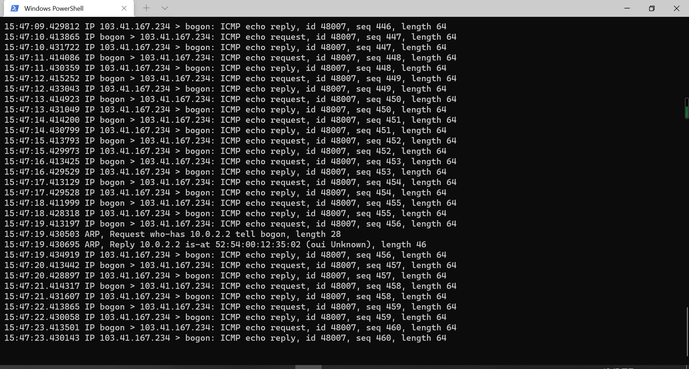

# 基于 VirtualBox 的网络攻防基础环境搭建

## 实验目的

- 掌握 VirtualBox 虚拟机的安装与使用；
- 掌握 VirtualBox 的虚拟网络类型和按需配置；
- 掌握 VirtualBox 的虚拟硬盘多重加载；

## 实验环境

以下是本次实验需要使用的网络节点说明和主要软件举例：

- VirtualBox 虚拟机
- 攻击者主机（Attacker）：Kali Rolling 2109.2
- 网关（Gateway, GW）：Debian Buster
- 靶机（Victim）：From Sqli to shell / xp-sp3 / Kali

## 实验要求

- 虚拟硬盘配置成多重加载，效果如下图所示；


- 搭建满足如下拓扑图所示的虚拟机网络拓扑；
  


根据实验宿主机的性能条件，可以适度精简靶机数量

完成以下网络连通性测试；
- [x] 靶机可以直接访问攻击者主机
- [x] 攻击者主机无法直接访问靶机
- [x] 网关可以直接访问攻击者主机和靶机
- [x] 靶机的所有对外上下行流量必须经过网关
- [x] 所有节点均可以访问互联网

## 实验过程

1.下载并安装虚拟机、修改为多重加载


2.设置网络


3.查看Debian ip地址并远程连接


3.配置网卡并且保存


```
# /etc/network/interfaces
# This file describes the network interfaces available on your system 
#and how to activate themFor more information, see interfaces(5).
source fetcnetwork/interfaces.d/*
#The loopback network interface
auto lo
iface lo inet loopback
 
# The primary network interface
allow-hotplug enp0s3
iface enp0s3 inet dhcp
post-up iptables -t nat -A POSTR0UTING -s 172.16.111.0/24 !-d 172.16.0.0/16 -0 enp0s3 -j MASQUERADE 
post-up iptables -t nat -A POSTROUTING -s 172.16.222.0/24 !-d 172.16.0.0/16 -0 enp0s3 -j MASQUERADE 
post-up iptables  -P  FORWARD  DROP
post-up iptables  -A  FORWARD  -m state--state RELATED,ESTABLISHED  -j ACCEPT
post-up iptables  -A  FORWARD  -s  '172.16.111.0/24' ! -d '172.16.0.0/16'  -j  ACCEPT 
post-up iptables  -A  FORWARD -s '172.16.222.0/24’ ! -d '172.16.0.0/16' -j ACCEPT 
post-up iptables  -I  INPUT -s 172.16.111.0/24-d172.16.222.0/24 -j DROP 
post-up iptables  -I  INPUT -s 172.16.222.0/24-d172.16.111.0/24 -j DROP 
post-up echo 1>/proc/sys/net/ipv4/ip_forward
post-down echo 0>/proc/sys/net/ipv4/ip_forward 
post-down iptables -t nat -F 
post-down iptables -F

allow-hotplug enp0s8 
iface enp0s8 inet dhcp

allow-hotplug enp0s9
iface enp0s9 inet static
address 172.16.111.1
netmask 255.255.255.0

allow-hotplug enp0s10 
iface enp0s10 inet static 
address 172.16.222.1
netmask 255.255.255.0
```

4.打开xp demo并进行操作

(1)将xp demo的控制芯片更改为PCnet—FAST 


(2)打开xp控制面板


(3)先手动的设置ip地址以及子网掩码和网关等。


(4)在xp终端里验证xp到host only的连通性。


(5)在Debian终端里验证连通性。


(6)

(7)将xp系统的网络设置改为自动获取


(8)下载dnsmasq


(9)验证双向连通性


5.打开kali并进行操作

(1)先查看kali的ip地址


(2)验证kali的连通性。


(3)验证攻击者主机无法直接访问靶机

6.在Debian终端进行操作

(1)安装tmux


(2)进行抓包



## 实验验证

1.靶机可以直接访问攻击者主机
(1)进行ping检查网络层的连通性，发现靶机可以直接访问攻击者主机

(2)根据计算机网络分层知识，网络层连通，则下面的链路层、物理层也连通，由此证明，靶机可以直接访问攻击者主机。

2.攻击者主机无法直接访问靶机

(1)对靶机的ip地址进行ping以后发现均无法连通

(2)为证明并不是由于kali-Attacker上不了网而无法ping，进行了ping baidu，连通性正常

3.网关可以直接访问攻击者主机和靶机

通过网关对攻击者和靶机进行ping，成功了，即说明网关可以直接访问攻击者主机和靶机。

4.靶机的所有对外上下行流量必须经过网关

(1)在靶机进行上互联网时，用网关进行抓包，如果靶机发出去的所有包都能被网关抓到，则说明靶机的所有对外上下行流量必须经过网关

(2)开始抓包并观察，发现靶机的上下行流量必须经过网关。另外，当关闭网关时，发现靶机不再能上网，则说明靶机的上下行流量必须经过网关。

5.所有节点均可以访问互联网.

## 参考文献

课本https://c4pr1c3.gitee.io/cuc-ns/chap0x01/exp.html

老师视频课程https://www.bilibili.com/video/BV16t4y1i7rz/

网络材料https://blog.csdn.net/lemonalla/article/details/105592150